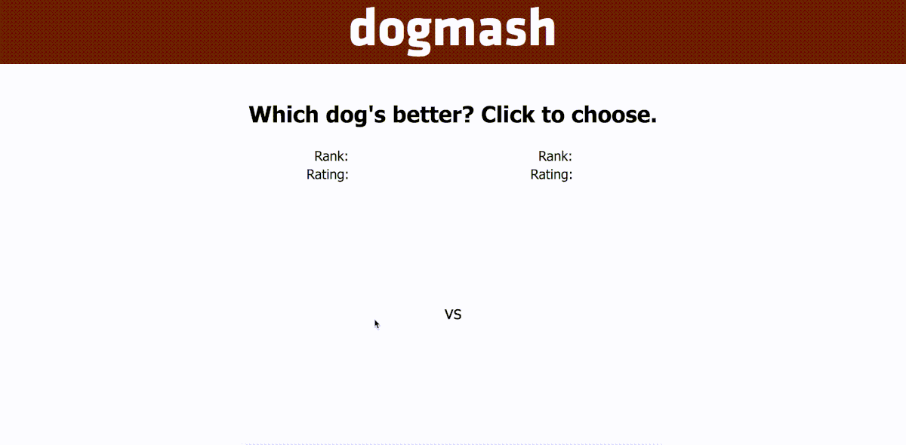

# dogmash



This is a basic clone of Mark Zuckerberg's FaceMash (except with dogs). I've used [Flask](http://flask.pocoo.org/) and [peewee](http://docs.peewee-orm.com/en/latest/) on the backend and [jQuery](http://jquery.com/) on the front end. Tests are written using the [pytest](https://docs.pytest.org/en/latest/) framework. Dogs' ratings are adjusted using the [Elo rating system](https://en.wikipedia.org/wiki/Elo_rating_system).

## Getting Started

### Prerequisites
Python 3.7+ is required, you can check your python version with
```
python3 --version
```

### Installing

#### Virtual Environment Setup
Create a virtual environment in the dogmash directory with
```
python3 -m venv env
```
and activate it with:
- Bash/Zsh: ```source env/bin/activate```
- Windows CMD: ```env\Scripts\activate.bat```

#### Dependencies
If you have [Poetry](https://github.com/sdispater/poetry) installed, then install the required dependencies with
```
poetry install --no-dev
```
Otherwise, you can install them with
```
pip install -r requirements.txt
```
## Usage
### Images
If you would like to use your own dog images, then place them in `dogmash/static/images/dogs`. It's recommended that they all have an aspect ratio of 3:4.

If you don't want to use your own images, then you can download some from [Unsplash](https://unsplash.com/) using the script `downloadimages.py`. (You will need to create an Unsplash application to get an API access key.)

Run the script with `downloadimages.py access_key [images]` where `access_key` is your Unsplash API access key and `images` is an optional argument specifying the number of images to download.

### Starting The Server
To start the server, you must first set the environment variable `FLASK_APP` with:
- Bash/Zsh: `export FLASK_APP=dogmash`
- Windows CMD: `set FLASK_APP=dogmash`

Finally, you can run the server with
```
flask run
```

The site will be served at `localhost:5000` by default.

## To do
- Use argparse or similar library to parse arguments to `downloadimages.py`
- ~~Refactor messy JS~~
- Write flask code in a more idiomatic way
